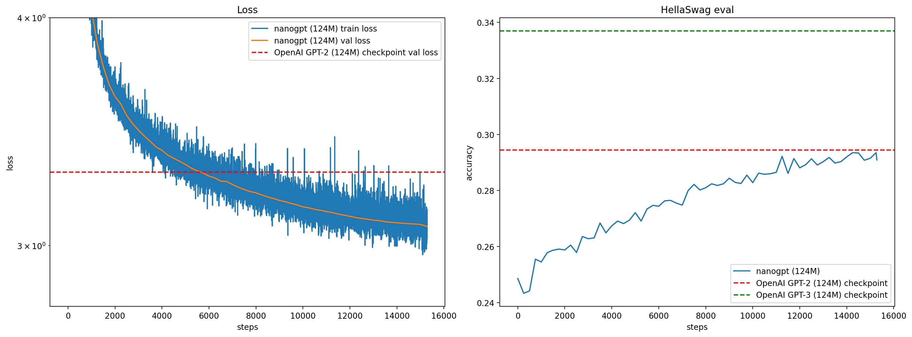

# 🧠 GPT-2 (124M) Training from Scratch in PyTorch

A clean, modular implementation of a GPT-2 (124M parameter) inspired by GPT2 Paper
autoregressive Transformer trained from scratch on **0.8B tokens** using
PyTorch, Distributed Data Parallel (DDP), gradient accumulation, cosine
learning rate scheduling, and Flash Attention.

This project reproduces GPT-2--style training dynamics and approaches
OpenAI GPT-2 124M checkpoint performance on HellaSwag.

------------------------------------------------------------------------

## 🚀 Project Overview

This repository implements a GPT-2--style decoder-only Transformer
architecture with:

-   ✅ Causal self-attention (`scaled_dot_product_attention`, Flash
    Attention)
-   ✅ Proper autoregressive masking (`is_causal=True`)
-   ✅ Residual scaling initialization
-   ✅ Weight tying (token embedding ↔ output head)
-   ✅ AdamW with selective weight decay
-   ✅ Cosine LR decay with warmup
-   ✅ Gradient accumulation for large effective batch sizes
-   ✅ Distributed Data Parallel (DDP)
-   ✅ HellaSwag evaluation pipeline
-   ✅ Log parsing + training visualization utilities

The model was trained on **800 million tokens (0.8B)**.

------------------------------------------------------------------------

## 🏗️ Architecture

Model configuration (GPT-2 124M equivalent):

  Parameter         Value
  ----------------- --------------------------
  Layers            12
  Attention Heads   12
  Embedding Dim     768
  Context Length    1024
  Vocabulary Size   50304 (padded GPT-2 BPE) (Padded to have a nice even number divisible by powers of 2)
  Parameters        \~124M

Core implementation:

    model_files/
      ├── config.py
      ├── model_main.py
      └── model_sublayer.py

------------------------------------------------------------------------

## ⚙️ Training Details

### 📊 Dataset
-   edu_fineweb10B_dataset 'sample-10BT' dataset
-   GPT-2 BPE tokenized shards (`.npy`)
-   Autoregressive next-token prediction
-   Total training tokens: **0.8B**

### 🧮 Batch Setup

  Setting                 Value
  ----------------------- ---------------
  Micro Batch Size (B)    32
  Sequence Length (T)     1024
  Gradient Accumulation   Dynamic
  Effective Batch Size    ~524K tokens

### 🔧 Optimization
-   Epochs: 1
-   Optimizer: **AdamW**
-   Betas: (0.9, 0.95)
-   Weight Decay: 0.1 (applied only to 2D parameters)
-   Gradient Clipping: 1.0
-   Mixed Precision: **bfloat16**
-   Learning Rate:
    -   Linear warmup
    -   Cosine decay

------------------------------------------------------------------------

## 📈 Results (After 0.8B Tokens)

### 🔻 Validation Loss

-   Final validation loss ≈ **3.10**
-   OpenAI GPT-2 (124M) checkpoint baseline: **3.29**

### 🧠 HellaSwag Accuracy

  Model                 Accuracy
  --------------------- ----------------
  This Model            0.292--0.294
  GPT-2 124M (OpenAI)   0.294
  GPT-3 124M            0.337

The model approaches GPT-2 checkpoint performance after training on only
0.8B tokens after 1 epoch.

------------------------------------------------------------------------

## 📊 Training Curves



Left: Train/Validation loss (log scale)\
Right: HellaSwag accuracy

------------------------------------------------------------------------

## 🖥️ Running Training

### Single GPU

``` bash
python train/train.py
```

### Multi-GPU (DDP)

``` bash
torchrun --standalone --nproc_per_node=NUM_GPUS train/train_DDP.py
```

------------------------------------------------------------------------

## 📊 Log Visualization

``` bash
python final_testing.py --log log/log.txt --sz 124M --out plots/log_plot.png
```

------------------------------------------------------------------------

## 📊 Data Preprocessing

``` bash

python -m dataset.data_preprocessing

```

------------------------------------------------------------------------


## 🧠 Key Implementation Highlights

### ✅ Causal Flash Attention

``` python
F.scaled_dot_product_attention(q, k, v, is_causal=True)
```

### ✅ Residual Scaling Initialization

Projection layers are scaled by:

(2 · n_layer)\^(-0.5)

### ✅ Weight Tying

``` python
self.transformer.wte.weight = self.lm_head.weight
```

### ✅ Proper DDP Token Sharding

Each process reads disjoint token windows to avoid overlap.

------------------------------------------------------------------------

## 📁 Project Structure

    data/
    dataset/
    model_files/
    train/
    test/
    plots/
    log/

------------------------------------------------------------------------

## 🔬 What This Demonstrates

This project demonstrates:

-   Transformer architecture implementation from scratch
-   Correct autoregressive masking
-   Large-scale token training
-   Stable large-batch optimization
-   Distributed training mechanics (DDP)
-   Reproducible evaluation pipelines
-   Benchmark comparison against GPT-2

------------------------------------------------------------------------

## 🧑‍💻 Author

**Likhit Sai Kothapalli**\
M.S. Computer Science (AI)\
University of Colorado Boulder
